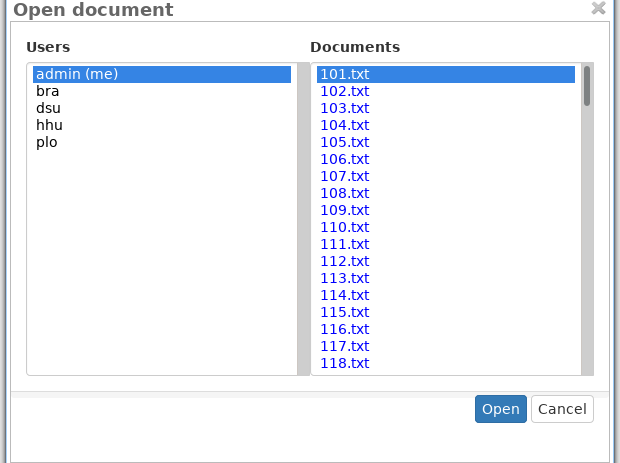
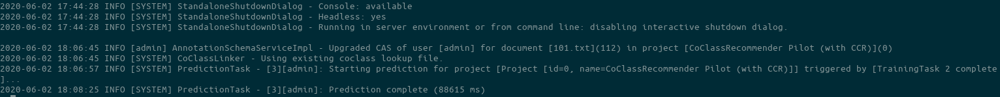
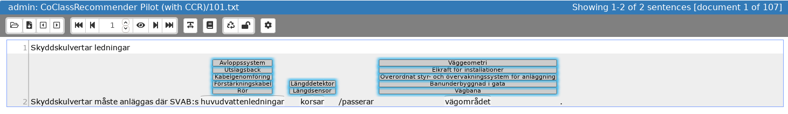

# Installation instructions
The artifacts can be downloaded from [Zenodo](http://doi.org/10.5281/zenodo.3827169).

The repository contains two archives: `instrumentation.tar.gz` and `analysis.tar.gz`.
Decompress these files first:

    tar xzf instrumentation.tar.gz
    tar xzf analysis.tar.gz

The resulting folders (`instrumentation` and `analysis`) are described next.

## Instrumentation
The source code of INCEpTION and our extension can be found in `inception-src.tar.gz`. The recommender is implemented in the module `inception-coclass-linking`. This archive is a snapshot of the code at the time of the experiment. The current version is available on our [github repository](https://github.com/munterkalmsteiner/inception), currently in the branch `CoClassRecommeder`.

### Replicating the experimental environment
1. execute `./run.sh` in the folder `SECOS`. This starts the decompounder service used by our recommender. 
2. execute `./run.sh` in the folder `inception`. This starts the INCEpTION server.
3. point your browser to `http://localhost:18080/inception-app-webapp/`. 
4. login with username `admin` and password `ccr2020`. 

For general instruction on how to use INCEpTION, please refer to the [project documentation](https://inception-project.github.io/documentation/).

To see an example of the suggestions produced by our recommender, follow these steps:

1. Open the project `CoClassRecommender Pilot (with CCR)`: 
        
    
2. Click on `Annotation`:
    
    
3. Open the first document:
    
    
4. Now wait until the recommender has done it's initialization (this is currently not cached and can take up to 3 minutes). Check out the console output of INCEpTION to see when the initial recommendations are ready:
    
    
5. Press `F5` to reload the page (unfortunately, new recommendations do not trigger an automatic page reload yet)
6. You should see now the produced recommendations:
    
    
7. Accept/reject a recommendation by clicking/double clicking on it.
8. Open another requirement:
    
    


#### Software requirements
We have compiled INCEpTION with the following java version:
```
openjdk version "11.0.6" 2020-01-14
OpenJDK Runtime Environment (build 11.0.6+10)
OpenJDK 64-Bit Server VM (build 11.0.6+10, mixed mode)
```

For best compatibility, we suggest to use a similar version when running INCEpTION.

## Analysis
This archive contains the data collected during the experiment, stored in spreadsheets, and the R scripts to analyze the data. If you open the R markdown (*.Rmd) files with Rstudio, the environment should offer the possibility to install the required statistical packages automatically.
